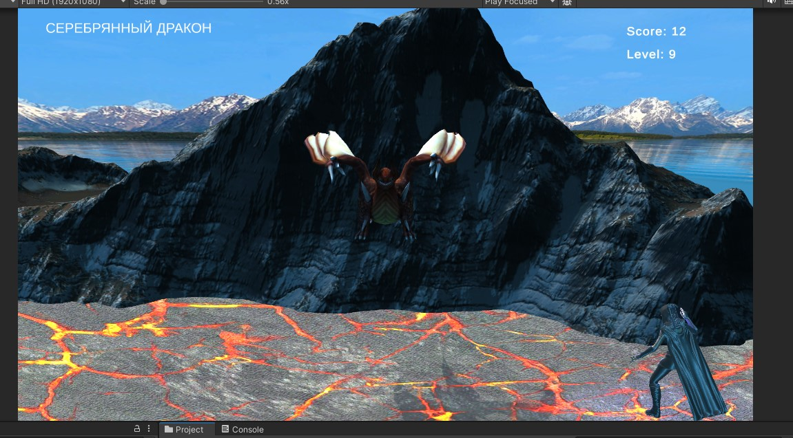
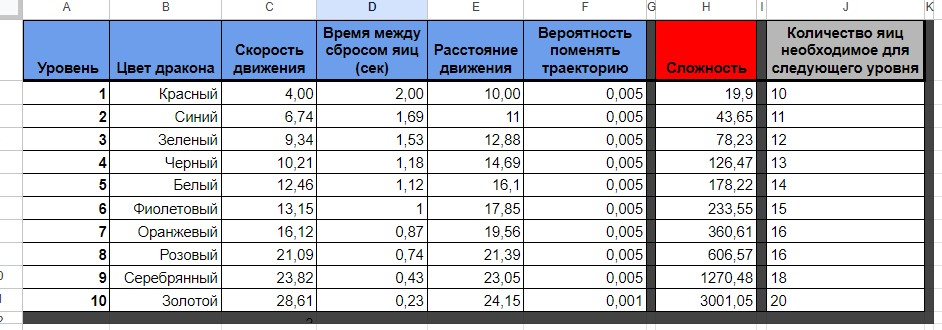
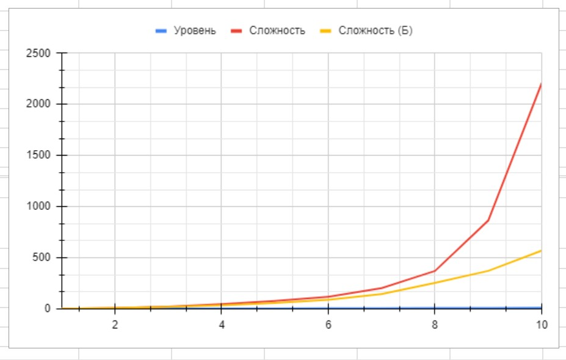

# АНАЛИЗ ДАННЫХ И ИСКУССТВЕННЫЙ ИНТЕЛЛЕКТ [AD in GameDev]
Отчет по *Лабораторной работе №3* выполнил:
- Крюков Никита Андреевич
- РИ-230915 (AT-01)

| Задание | Выполнение | Баллы |
| ------ | ------ | ------ |
| Задание 1 | * | ? |
| Задание 2 | * | ? |
| Задание 3 | * | ? | 

Работу проверили:
- к.т.н., доцент Денисов Д.В.
- к.э.н., доцент Панов М.А.
- ст. преп., Фадеев В.О.


# Введение

## Цель работы
Разработать оптимальный баланс изменения сложности для десяти уровней игры Dragon Picker.


## Важное замечание
В игре, которая по [ссылке](https://i.simmer.io/@Den1sov/dragon-picker) и проекте на Unity, который предоставили есть небольшие отличия. В работе сконцентрируемся на балансе, а не на разработке игры *(так я оправдаю некоторые свои технические не правильные решения)*. Поэтому, **предположим, что для убийства дракона (перехода на новый уровень) нужно собрать определенное кол-во яиц.** Будем отталкиваться от этого. В случае если игрок соберет определенно кол-во яиц, то он переходит на следующий уровень, к другому дракону. Из статистики, которая я собрал играя в игру по ссылке **достаточно собрать 10 яиц, чтобы уничтожить первого дракона.** Остальные стартовые данные (скорость дракона, вероятность сменить направление движения) я взял относительно данных, которые уже были в проекте.


## Начало работы с прототипом
**Какие переменные влияют на движение дракона на сцене?**
- *Скорость движения дракона.* Эта переменная определяет, насколько быстро дракон двигается влево или вправо *(speed)*.
- *Расстояние, на которое дракон может двигаться влево и вправо.* Эта переменная определяет границы, в пределах которых дракон может двигаться *(leftRightDistance)*.
- *Вероятность изменения направления движения дракона.* Эта переменная определяет, с какой вероятностью дракон может случайно изменить направление движения *(chanceDirection)*.

**Какие переменные влияют на сложность игры на сцене? Укажите эти переменные.**
- *Скорость движения дракона.* Чем выше скорость, тем сложнее игроку будет уследить за драконом *(speed)*.
- *Время между сбросами яиц.* Чем меньше это значение, тем чаще дракон будет сбрасывать яйца, что увеличивает сложность игры так как нужно будет больше концентрации *(timeBetweenEggDrops)*.
- *Расстояние, на которое дракон может двигаться влево и вправо.* Чем больше это расстояние, тем больше пространства дракон может охватить, что также может также усложнить реакцию игрока *(leftRightDistance)*.
- *Вероятность изменения направления движения дракона.* Чем выше эта вероятность, тем чаще дракон будет менять направление движения, что делает его поведение менее предсказуемым и увеличивает сложность игры *(chanceDirection)*.

Ещё в игре есть такая переменная как: *количество энергетических щитов.* Чем больше щитов, тем больше права на ошибку будет у игрока *(numEnergyShield)*. Сохраним это значение на трёх, как будто это количество здоровья. **Если игрок уронит яйцо, то количество накопленных яиц сбросить, количество щитов уменьшиться.**

**Важно,** что высокая вероятность дракона изменить траекторию не играет ключевую роль, так как дракон просто может застыть на месте постоянно меня свою траекторию, учтем это при подборе данных. Дополнительно был модифицирован скрип яйца [DragonEgg.cs](https://github.com/ytkinroman/urfu_3/blob/main/Assets/_Scripts/DragonEgg.cs), чтобы ускорить его падение, хотя с другой стороны можно было бы рассмотреть силу выстрела драконом яйца для повышения сложности.


## Начало работы с шаблоном google-таблицы для балансировки игры
**Отметьте, как может быть использован шаблон таблицы для визуализации изменения уровней сложности в игре Dragon Picker?**

В данном шаблоне приведен пример таблицы для балансировки оружия. Представлено оружие, информация об уроне и так далее. Важное значение в этой таблице имеет вероятность на промах в зависимости от расстояния, который играет ключевую роль в балансировке. В нашем случае, для расчета сложности уровня будет достаточно характеристики дракона.


# Задание 1
*Предложите вариант изменения найденных переменных для 10 уровней в игре. Визуализируйте изменение уровня сложности в таблице.*

Ход работы:
- Создать таблицу для 10 уровней в которую перенесу характеристики драконов.
- Сгенерировать характеристики каждого дракона отталкиваясь от начальных данных *c случайным шагом отталкиваясь от предыдущих данных*.
- Визуализировать данные.
- Сбалансировать характеристики в зависимости от игрового опыта.

**Про то, как я заполнял все данные с помощью Python смотреть в "Задание 3".**

Я изучил шаблон, который вы предоставили, он очень крутой. Проанализировав шаблон и переменные, которые влияют на сложность игры, мною была разработана следующая таблица, чтобы отследить изменение данных:


# Задание 2
Ход работы:
- Скачиваем шаблон проекта.
- Создаём таблицу с данными **(см. задание 3)**
- Делам скрипты, которые будут копировать данные с google таблицы.
- Вносим небольшие изменения в игру, чтобы было комфортно играть используя данные из таблицы.

## Загружаем данные из таблицы в игру
Этот пункт самый объемный. Как будет происходить выгрузка данных из google таблицы в игру? Создадим скрипт [DataLoader.cs](https://github.com/ytkinroman/urfu_3/blob/main/Assets/_Scripts/DataLoader.cs), а также импортируем скрипты SimpleJSON, SimpleJSONBinary, SimpleJSONDotNetTypes, SimpleJSONUnity из прошлой практической работы. Этот скрипт будет создавать статичный словарь, доступ к которому могут получать другие скрипты. После длительного программирования методом тыка был сделан код, который берёт сбалансированные значения из моей google таблицы и создаёт словарь, где уровень - это основной ключ. Уровень содержит в себе ещё несколько ключей с характеристиками дракона.

DataLoader.cs:
```cpp

using System;
using System.Collections;
using System.Collections.Generic;
using UnityEngine;
using UnityEngine.Networking;
using SimpleJSON;

public class DataLoader : MonoBehaviour
{
    private const string URL = "https://sheets.googleapis.com/v4/spreadsheets/XXXXXXXXXX";
    public static Dictionary<int, DataEntry> dataSet = new Dictionary<int, DataEntry>();
    public static event Action OnDataLoaded;

    private void Start () {
        StartCoroutine(GoogleSheets());
    }

    private IEnumerator GoogleSheets () {
        UnityWebRequest currentResp = UnityWebRequest.Get(URL);
        yield return currentResp.SendWebRequest();

        if (currentResp.result != UnityWebRequest.Result.Success) {
            Debug.LogError("Failed to load data: " + currentResp.error);
            yield break;
        }

        string rawResp = currentResp.downloadHandler.text;
        var rawJson = JSON.Parse(rawResp);

        int headerRowIndex = 14; // Индекс 15-й строки.
        int currentRowIndex = 0;

        foreach (var itemRawJson in rawJson["values"]) {
            if (currentRowIndex <= headerRowIndex) {
                currentRowIndex++;
                continue; // Пропускаем строки до заголовка
            }

            var parseJson = JSON.Parse(itemRawJson.ToString());
            var selectRow = parseJson[0].AsStringList;

            int level = int.Parse(selectRow[0]);
            dataSet[level] = new DataEntry(
                float.Parse(selectRow[2]),
                float.Parse(selectRow[3]),
                float.Parse(selectRow[4]),
                float.Parse(selectRow[5]),
                float.Parse(selectRow[9])
            );
        }

        // Debug.Log(dataSet[10].Speed);
        OnDataLoaded?.Invoke();
    }

    public class DataEntry
    {
        public float Speed { get; }
        public float TimeBetweenEggDrops { get; }
        public float LeftRightDistance { get; }
        public float ChanceDirection { get; }

        public float EggsNumber { get; }

        public DataEntry (float speed, float timeBetweenEggDrops, float leftRightDistance, float chanceDirection, float eggsNumber) {
            Speed = speed;
            TimeBetweenEggDrops = timeBetweenEggDrops;
            LeftRightDistance = leftRightDistance;
            ChanceDirection = chanceDirection;
            EggsNumber = eggsNumber;
        }
    }
}

```

Далее мы отредактируем скрипт дракона [EnemyDragon.cs](https://github.com/ytkinroman/urfu_3/blob/main/Assets/_Scripts/EnemyDragon.cs), чтобы он читал характеристики из словаря и присваивал их себе. Наши данные размечены очень правильно. Уровень драконы мы будем определять по индексу сцены в Unity. Если дракон 1 уровня, то и сцена 1 уровня потому что самая первая сцена с главным меню имеет индекс 0. **Соответственно,** сначала мы определяем индекс сцены, который равен уровню, а потом запросим данные из словарю используя номер уровня как ключ, присвоим их дракону.

EnemyDragon.cs:
```cpp

using System.Collections;
using System.Collections.Generic;
using UnityEngine;
using UnityEngine.SceneManagement;


public class EnemyDragon : MonoBehaviour
{
    public GameObject dragonEggPrefab;
    public float speed = 4;
    public float timeBetweenEggDrops = 2f;
    public float leftRightDistance = 10f;
    public float chanceDirection = 0.01f;

    public int sceneIndex;
    private bool dataApplied = false;


    private void Start ()
    {
        sceneIndex = SceneManager.GetActiveScene().buildIndex;
        Invoke("DropEgg", 4f);
    }

    private void DropEgg ()
    {
        Vector3 myVector = new Vector3(0.0f, 5.0f, 0.0f);
        GameObject egg = Instantiate<GameObject>(dragonEggPrefab);
        egg.transform.position = transform.position + myVector;
        Invoke("DropEgg", timeBetweenEggDrops);
    }


    private void Update ()
    {
        Vector3 pos = transform.position;
        pos.x += speed * Time.deltaTime;
        transform.position = pos;

        if (pos.x < -leftRightDistance) {
            speed = Mathf.Abs(speed);
        }
        else if (pos.x > leftRightDistance) {
            speed = -Mathf.Abs(speed);
        }

        if (!dataApplied && DataLoader.dataSet.ContainsKey(sceneIndex)) {
            DataLoader.DataEntry dataEntry = DataLoader.dataSet[sceneIndex];
            ApplyData(dataEntry);
            dataApplied = true;
        }
    }

    private void ApplyData (DataLoader.DataEntry dataEntry)
    {
        speed = dataEntry.Speed;
        timeBetweenEggDrops = dataEntry.TimeBetweenEggDrops;
        leftRightDistance = dataEntry.LeftRightDistance;
        chanceDirection = dataEntry.ChanceDirection;
    }

    private void FixedUpdate ()
    {
        if (Random.value < chanceDirection) {
            speed *= -1;
        }
    }
}

```

Далее изменим скрипт [EnergyShield.cs](https://github.com/ytkinroman/urfu_3/blob/main/Assets/_Scripts/EnergyShield.cs) который подсчитывает количество пойманных яиц. Для начало я добавлю переменную уровня, чтобы прокачать интерфейс и мы могли наблюдать за тем, на каком уровне находимся. После этого, также будем читать словарь по индексу сцены, чтобы узнать какое количество яиц нужно, чтобы перейти на следующий уровень. Сделаем проверку, если количество яиц необходимое для перехода на новый уровень равно количеству яиц которые поймал игрок, то мы переходим на новую сцену. Новая сцена соответственно будет с новыми характеристиками.

EnergyShield.cs
```cpp

using System.Collections;
using System.Collections.Generic;
using UnityEngine;
using TMPro;
using UnityEngine.SceneManagement;
using static DataLoader;

public class EnergyShield : MonoBehaviour
{
    public TextMeshProUGUI scoreGT;
    public TextMeshProUGUI levelGT;
    public AudioSource audioSource;

    public int sceneIndex;
    private bool dataApplied = false;

    float eggsNumber;
    int score = 0;


    private void Start () {
        GameObject scoreGO = GameObject.Find("Score");
        if (scoreGO != null) {
            scoreGT = scoreGO.GetComponent<TextMeshProUGUI>();
            scoreGT.text = "Score: 0";
        }

        sceneIndex = SceneManager.GetActiveScene().buildIndex;
        GameObject levelGO = GameObject.Find("Level");
        if (levelGO != null) {
            levelGT = levelGO.GetComponent<TextMeshProUGUI>();
            levelGT.text = $"Level: {sceneIndex}";
        }
    }

    private void Update ()
    {
        Vector3 mousePos2D = Input.mousePosition;
        mousePos2D.z = -Camera.main.transform.position.z;
        Vector3 mousePos3D = Camera.main.ScreenToWorldPoint(mousePos2D);
        Vector3 pos = this.transform.position;
        pos.x = mousePos3D.x;
        this.transform.position = pos;

        if (!dataApplied && DataLoader.dataSet.ContainsKey(sceneIndex)) {
            DataLoader.DataEntry dataEntry = DataLoader.dataSet[sceneIndex];
            eggsNumber = dataEntry.EggsNumber;
            dataApplied = true;
        }

        if (dataApplied && score == eggsNumber) {
            LoadNextScene();
        }
    }

    private void OnCollisionEnter (Collision coll) {
        GameObject Collided = coll.gameObject;
        if (Collided.tag == "Dragon Egg") {
            Destroy(Collided);
        }

        // Извлекаем числовое значение из строки
        score += 1;
        scoreGT.text = $"Score: {score}";

        audioSource = GetComponent<AudioSource>();
        audioSource.Play();
    }

    private void LoadNextScene () {
        int nextSceneIndex = sceneIndex + 1;
        if (nextSceneIndex < SceneManager.sceneCountInBuildSettings) {
            SceneManager.LoadScene(nextSceneIndex);
        }
        else {
            Debug.Log("No more scenes to load. Closing the game.");
            Application.Quit();
        }
    }
}

```

Добавленный интерфейс: 



# Задание 3

#### Заполнение данных google таблицы.
Исходя из проанализированных выше данных составляем табличку. Заполнять эту табличку будет используя JypyterLab. 
Создаём [jypyter](https://github.com/ytkinroman/urfu_3/blob/main/jupiter_project/code_file_1.ipynb). Подключаем табличку к проекту по методичке прошлой практической работы (я просто скопирую из предыдущей практической работы). Будем генерировать значения для характеристик драконов случайным шагом (на глаз) отталкиваясь от значений первого дракона (Красный дракон), данные для которого я взял из предоставленного проекта. В дальнейшем данные нужно исправить балансировкой, если они нам не подойдут. В папке [jypyter_project](https://github.com/ytkinroman/urfu_3/tree/main/jupiter_project) вы найдите полный файл c кодом и можете ознакомиться.
Фрагмент кода из ноутбука (Будем называть его так): 


Табличка которая получилась: 


#### Балансировка.

Из игрового опыта хочется рассмотреть максимальный уровень - 10 т.е золотого дракона. Значения из-за которых есть проблемы это - время сброса яиц (timeBetweenEggDrops) и расстояние движение (leftRightDistance), остальные значения были выбраны корректно. Самое максимальное значение leftRightDistance=21 т.к дракон просто на просто сбрасывает яйца или за пределами экрана или прям близко к границе экрана, что крайне не удобно. Что касается время сброса яиц установим предел в timeBetweenEggDrops=0.6 т.к это самое комфортное время, если брать время меньше, то дракон сбрасывает уже несколько яиц, с учетом того, что игрок не поймал ещё даже первое, такой опыт будет являться отрицательным для игрока.

Выполним балансировку в том же [jypyter ноутбуке](https://github.com/ytkinroman/urfu_3/blob/main/jupiter_project/code_file_1.ipynb) столбиков с временем сброса яиц и расстоянием движения с учетом замечания выше т.е сгенерируем их заново. Полный файл можно посмотреть тут. Дополнительно в ручную снизил необходимое кол-во яиц для перехода на следующий уровень (чтобы игра побыстрее закончилась) для предпоследних трех уровней.
Фрагмент кода из jypyter ноутбука: 


**Интересный факт,** после выполнения балансировки сложность дракона на уровне 10 значительно уменьшилась, теперь он сложнее не в 1000 раз а всего в 300 раз, балансировку считаю успешной. 😁

График: 


Результаты балансировки: 


## Выводы
Была проделана колоссальная работа в которой я постарался разработать оптимальный баланс изменения сложности для десяти уровней игры Dragon Picker, процесс включал в себя тщательное планирование уровней, чтобы обеспечить плавное увеличение сложности и удержание интереса игрока.

Также, в ходе работы над проектом позволила мне освежить и углубить свои навыки в области программирования на Python и Unity C#. Это было особенно полезно, так как позволило мне применить теоретические знания на практике, решая реальные задачи. В результате, я не только улучшил свои технические навыки, но и получил ценный опыт в разработке игр, что будет полезно в моих будущих проектах.


Буду ждать комментариев по поводу моего отчёта, хорошего Вам дня !


