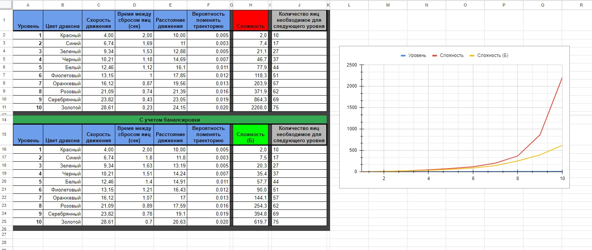
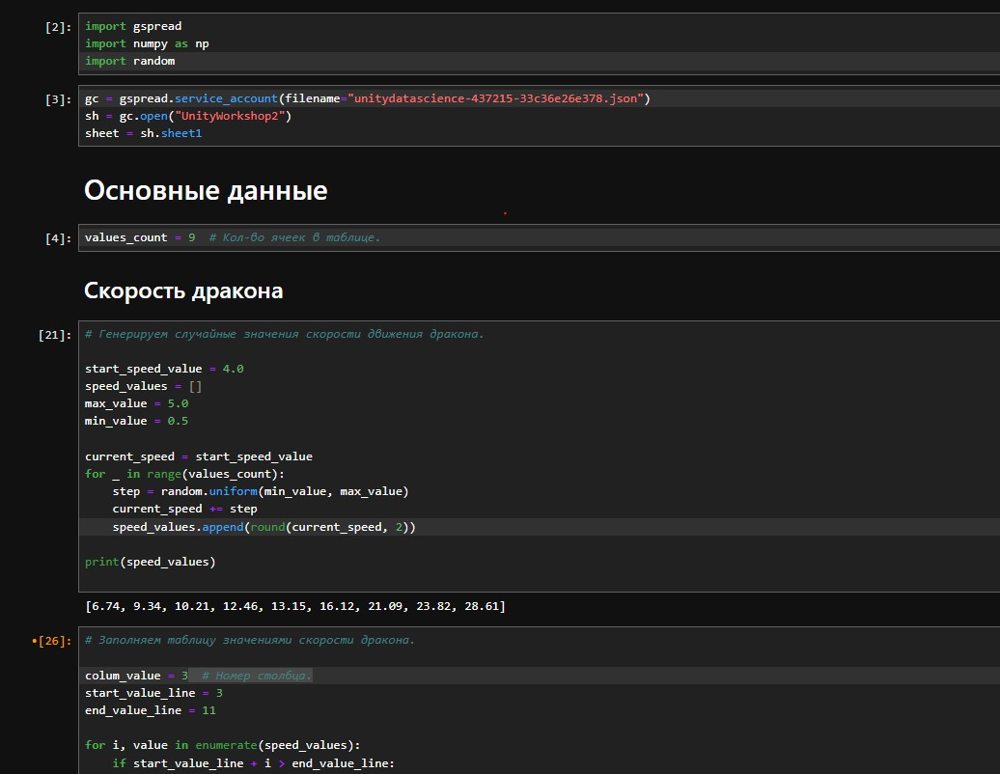
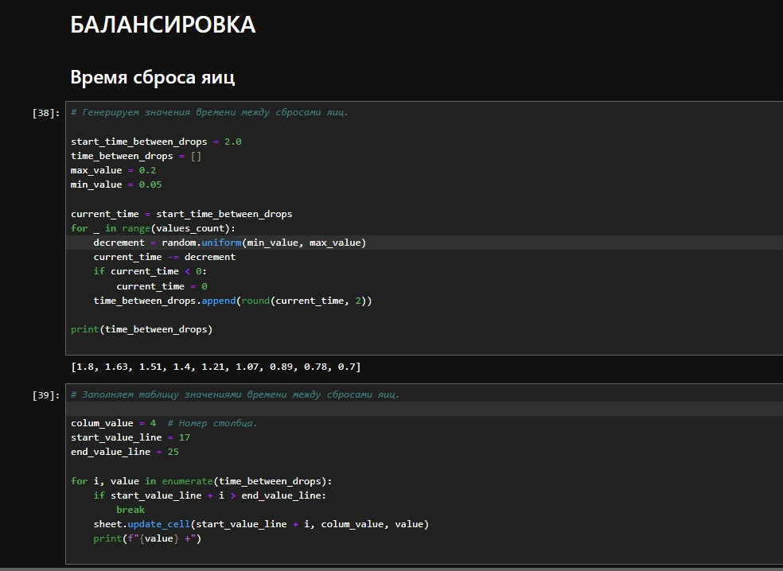
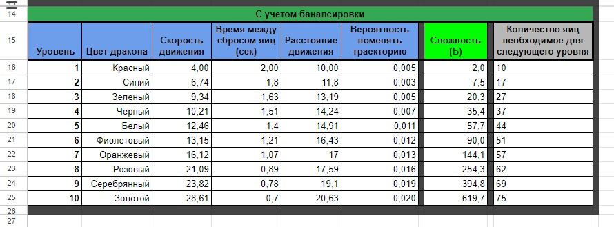

# АНАЛИЗ ДАННЫХ И ИСКУССТВЕННЫЙ ИНТЕЛЛЕКТ [AD in GameDev]
Отчет по *Лабораторной работе №3* выполнил:
- Крюков Никита Андреевич
- РИ-230915 (AT-01)

| Задание | Выполнение | Баллы |
| ------ | ------ | ------ |
| Задание 1 | * | ? |
| Задание 2 | * | ? |
| Задание 3 | * | ? | 

Работу проверили:
- к.т.н., доцент Денисов Д.В.
- к.э.н., доцент Панов М.А.
- ст. преп., Фадеев В.О.

## Цель работы
Разработать оптимальный баланс изменения сложности для десяти уровней игры Dragon Picker.

## Важное замечание
В игре, которая по [ссылке](https://i.simmer.io/@Den1sov/dragon-picker) и проекте на Unity, который предоставили есть небольшие отличия. В работе сконцентрируемся на балансе, а не на разработке игры. Поэтому, **предположим, что для убийства дракона нужно собрать определенное кол-во яиц.** Будем отталкиваться от этого. В случае если игрок соберет определенно кол-во яиц, то он переходит на следующий уровень, к другому дракону. Из статистики, которая я собрал играя в игру по ссылке **достаточно собрать 10 яиц, чтобы уничтожить первого дракона.** Остальные стартовые данные я взял относительно данных, которые уже были в проекте.

## Начало работы с прототипом
**Какие переменные влияют на движение дракона на сцене?**
- *Скорость движения дракона.* Эта переменная определяет, насколько быстро дракон двигается влево или вправо (speed).
- *Расстояние, на которое дракон может двигаться влево и вправо.* Эта переменная определяет границы, в пределах которых дракон может двигаться (leftRightDistance).
- *Вероятность изменения направления движения дракона.* Эта переменная определяет, с какой вероятностью дракон может случайно изменить направление движения (chanceDirection).

**Какие переменные влияют на сложность игры на сцене? Укажите эти переменные.**
- *Скорость движения дракона.* Чем выше скорость, тем сложнее игроку будет уследить за драконом (speed).
- *Время между сбросами яиц.* Чем меньше это значение, тем чаще дракон будет сбрасывать яйца, что увеличивает сложность игры так как нужно будет больше концентрации (timeBetweenEggDrops).
- *Расстояние, на которое дракон может двигаться влево и вправо.* Чем больше это расстояние, тем больше пространства дракон может охватить, что может также усложнить реакцию игрока (leftRightDistance).
- *Вероятность изменения направления движения дракона.* Чем выше эта вероятность, тем чаще дракон будет менять направление движения, что делает его поведение менее предсказуемым и увеличивает сложность игры (chanceDirection).

Ещё в игре есть такая переменная как: *количество энергетических щитов.* Чем больше щитов, тем больше права на ошибку будет у игрока (numEnergyShield). Сохраним это значение на трёх, как будто это количество здоровья.

## Начало работы с шаблоном google-таблицы для балансировки игры
**Отметьте, как может быть использован шаблон таблицы для визуализации изменения уровней сложности в игре Dragon Picker?**

В данном шаблоне приведен пример таблицы для балансировки оружия. Представлено оружие, информация об уроне и так далее. Важное значение в этой таблице имеет вероятность на промах в зависимости от расстояния, который играет ключевую роль в балансировке. В нашем случае, для расчета сложности уровня будет достаточно характеристики дракона.

## Задание 1
*Предложите вариант изменения найденных переменных для 10 уровней в игре. Визуализируйте изменение уровня сложности в таблице.*

Ход работы:
- Создать таблицу для 10 уровней в которую перенесу характеристики драконов.
- Сгенерировать характеристики каждого дракона отталкиваясь от начальных данных *c случайным шагом отталкиваясь от предыдущих данных*.
- Визуализировать данные.
- Сбалансировать характеристики в зависимости от игрового опыта.

Я изучил шаблон, который вы предоставили, он очень крутой. Проанализировав шаблон и переменные, которые влияют на сложность игры, мною была разработана следующая таблица, чтобы отследить изменение данных:

**Про то, как я заполнял все данные с помощью Python смотреть в "Задание 3".**

**Важно,** что высокая вероятность дракона изменить траекторию не играет ключевую роль, так как дракон просто может застыть на месте постоянно меня свою траекторию, учтем это при подборе данных. Дополнительно был модифицирован скрип яйца DragonEgg.cs добавлением rb.velocity чтобы ускорить его падение.

## Задание 2

## Задание 3

#### Заполнение данных google таблицы.
Исходя из проанализированных выше данных составляем табличку. Заполнять эту табличку будет используя JypyterLab. 
Подключаем табличку к проекту по методичке прошлой практической работы (я просто скопирую из предыдущей практической работы). Будем генерировать значения для характеристик драконов случайным шагом (на глаз) отталкиваясь от значений первого дракона (Красный дракон), данные для которого я взял из предоставленного проекта. В дальнейшем данные нужно исправить балансировкой, если они нам не подойдут. В папке jypyter_project вы найдите полный файл c кодом и можете ознакомиться.
Фрагмент кода из jypyter файла (Будем называть его так): 

#### Балансировка.

Из игрового опыта хочется рассмотреть максимальный уровень - 10 т.е золотого дракона. Значения из-за которых есть проблемы это - время сброса яиц (timeBetweenEggDrops) и расстояние движение (leftRightDistance), остальные значения были выбраны корректно. Самое максимальное значение leftRightDistance=21 т.к дракон просто на просто сбрасывает яйца или за пределами экрана или прям близко к границе экрана, что крайне не удобно. Что касается время сброса яиц установим предел в timeBetweenEggDrops=0.6 т.к это самое комфортное время, если брать время меньше, то дракон сбрасывает уже несколько яиц, с учетом того, что игрок не поймал ещё даже первое, такой опыт будет являться отрицательным для игрока.

Выполним балансировку в том же jypyter файле столбиков с временем сброса яиц и расстоянием движения с учетом замечания выше т.е сгенерируем их заново. Полный файл можно посмотреть тут.
Фрагмент кода из jypyter файла: 

**Интересный факт,** после выполнения балансировки сложность дракона на уровне 10 значительно уменьшилась, теперь он сложнее не в 1000 раз а всего в 300 раз. 😁

Результаты балансировки: 

## Выводы
Была проделана колоссальная работа в которой я постарался разработать оптимальный баланс изменения сложности для десяти уровней игры Dragon Picker, процесс включал в себя тщательное планирование уровней, чтобы обеспечить плавное увеличение сложности и удержание интереса игрока.

Также, в ходе работы над проектом позволила мне освежить и углубить свои навыки в области программирования на Python и Unity C#. Это было особенно полезно, так как позволило мне применить теоретические знания на практике, решая реальные задачи. В результате, я не только улучшил свои технические навыки, но и получил ценный опыт в разработке игр, что будет полезно в моих будущих проектах.

Буду ждать комментариев по поводу моего отчёта, хорошего Вам дня !

